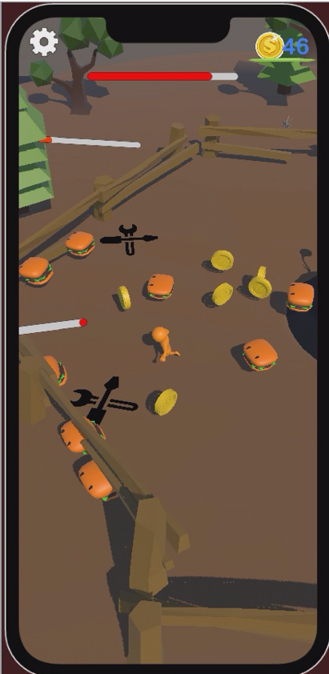
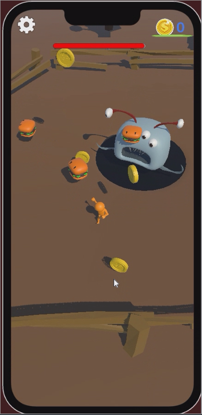

# Burger Hunt
This project is made for UDO Games Next Gen Developers Internship Program. After 3 weeks of training,  we crated a game in 4 days working as a groups.
We decided to make an Arcade Idle Hypercasual game. You can acces our GDD [by this link](https://closed-centipede-fae.notion.site/Burger-Hunting-38b74de12102416d9bc765ac1b123e16?pvs=4).
We used trello for organizeing the project [our trello page](https://trello.com/b/KrJdfYPU/burgerhunt) . 

# Team
-  [Ata Ayyıldız](https://github.com/satas20)

-  [Arif Ulaş Demirdöven](https://github.com/godzago)

-  [Ahmet Senocak](https://github.com/ahmetsenocak)

## How To Play
The goal is to keep the monster. The burgers are escaping from the monster and we try to catch burgers and feed the monster with the burgers. We have six fences to keep burgers inside but burgers can brake the fences. We can repair fences using our coins. We can earn coins by feeding the monster.
 

## Unity Version
- 2022.3.5f1

## Preview
### [For More Gameplay](https://drive.google.com/drive/folders/1lg1Y3P16rXdPPE3Rl0DQR02GRtOsyjiI?usp=sharing) 

  
  
 

  
  

  

